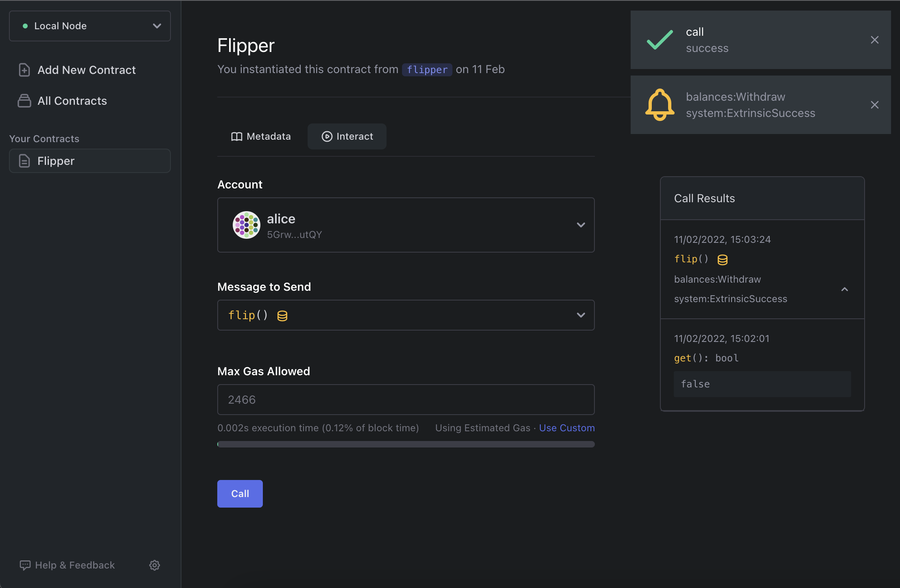
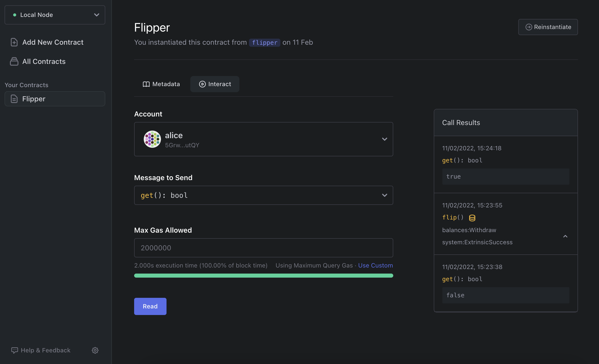

Now that your contract has been fully deployed, we can start interacting with it! Flipper only has
two functions: `flip()` and `get()`. We will show you what it's like to play with both of them.

## Using the Contracts UI

### 1. `get()` function

We set the initial value of the Flipper contract
`value` to `false` when we instantiated the contract. Let's check that this is the case.

In the **Message to Send** section, select the "**get(): bool**" message and accept the default
values for the other options.

Press **"Read"** and confirm that it returns the value `false`:


### 2. `flip()` function

So let's make the value turn `true` now!

The alternative message to send with the UI is `flip()`. Again, accept the default values for the other options and click **Call**



If the transaction was successful, we should then be able to go back to the `get()` function and see our updated storage:



## Using `cargo-contract`

The above can be done via the command-line as well. 

### 1. `get()` function

```bash
cargo contract build
cargo contract upload --suri //Alice

cargo contract instantiate --suri //Alice --args true
# The output of this command will contain the contract address,
# insert it in the command below.

cargo contract call --contract ... --message get  --dry-run --suri //Alice
```

### 2. `flip()` function

```bash
cargo contract call --contract ... --message flip --suri //Alice
```
